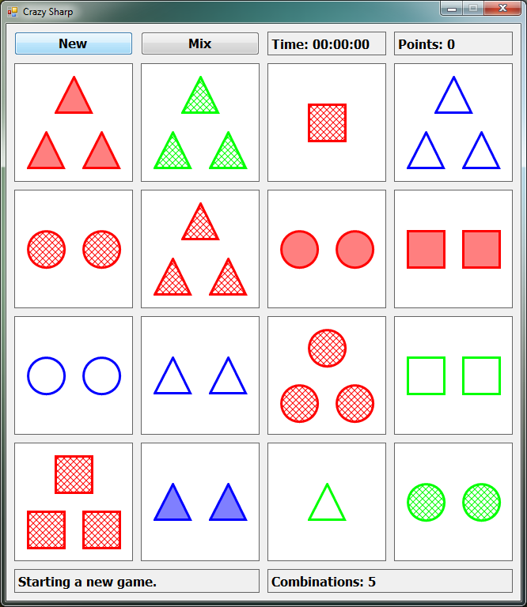

# Crazy-Sharp

### Beschreibung:
Ein kleines Remake des Spiels "Crazy Sets" aus den 90er Jahren in C#.

Es ist ein Knobelspiel, bei dem man 3 Karten anhand ihrer Eigenschaften (Form, Farbe, Anzahl, Füllung) kombinieren muss. Ziel ist es, alle 81 Karten so zu kombinieren, dass keine mehr übrig bleibt. Dabei ist Aufmerksamkeit, Kombinationsgabe und selektive Wahrnehmung gefragt.

### Bild:

